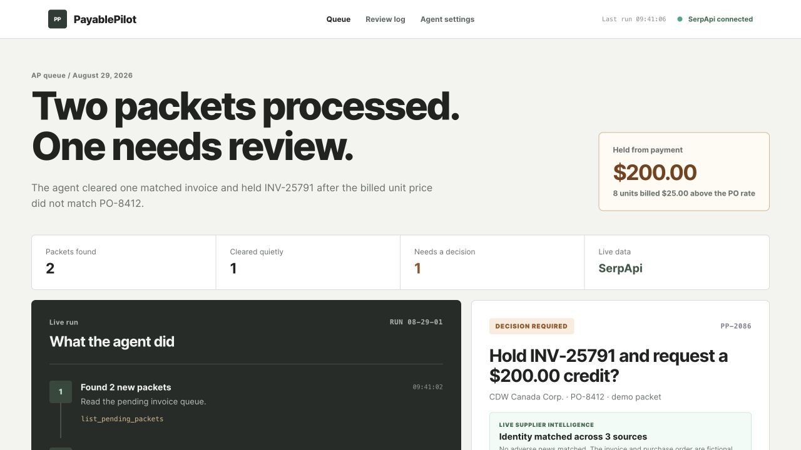
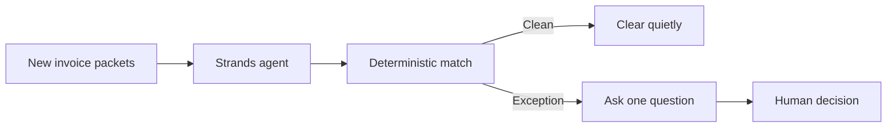

# PayablePilot

PayablePilot runs an accounts payable queue through a Strands agent. The agent
opens each packet, calls the matching tools, clears the packet that agrees, and
puts the exception in a review queue.

Try the public demo: https://jonny7171.github.io/payable-pilot/

Try the Nebius + NVIDIA mode:
https://jonny7171.github.io/payable-pilot/?engine=nebius

Try the SerpApi supplier-intelligence mode:
https://jonny7171.github.io/payable-pilot/?engine=serpapi

Inspect the latest sanitized Strands + SerpApi run evidence:
https://jonny7171.github.io/payable-pilot/proof/strands-serpapi-run.json

Inspect the AgentCore-compatible HTTP contract proof:
https://jonny7171.github.io/payable-pilot/proof/agentcore-contract-run.json

Watch the 48-second walkthrough: https://youtu.be/szxQIb9EidQ

The included run processes two fictional packets. It clears the packet whose
purchase order, invoice, and receipt agree. It holds the other because eight
monitor arms were invoiced at $119 each instead of the $94 purchase-order rate.
The resulting price difference is $200.



## What the agent does

The work has several steps and the next step depends on what the packet contains.
Strands chooses which tool to call. TypeScript performs the document comparison
and arithmetic. The agent cannot approve an exception or change a calculated
amount.

The public page is a replay of the included fixture so the review state is easy
to inspect without AWS credentials. The repository contains the executable
Strands loop, a deterministic test model, four core workflow tools, one optional
live supplier-research tool, and tests that verify the tool order and the $200
result. The linked evidence file proves a real Strands tool loop with live
SerpApi calls. It does not claim to be a Bedrock, AgentCore, or live-LLM run.

## Architecture




## Run the deterministic workflow

```bash
pnpm install
pnpm test
pnpm demo
pnpm agent:offline
pnpm agent:proof
```

`agent:offline` drives the real Strands agent loop with a deterministic test
model. It is a credential-free integration harness, not the production model.
`agent:proof` loads `.env.local`, runs the same loop with live supplier research,
and prints the tool calls and results used to create the public proof file.

## Run the Strands agent

Configure AWS credentials with Bedrock model access, then:

```bash
cp .env.example .env
pnpm agent
```

The repository also includes an AgentCore-compatible HTTP runtime with `/ping`
and `/invocations` endpoints:

```bash
pnpm agentcore:build
pnpm agentcore:offline
```

`agentcore:offline` runs the full HTTP invocation contract with the explicit
deterministic proof model. It verifies the runtime without cloud credentials
and is not presented as an AgentCore deployment or Bedrock run. For the real
Bedrock-backed runtime, configure AWS credentials and run:

```bash
pnpm agentcore:start
```

It also exposes the deterministic decision engine at `POST /v1/decisions` for
API clients. The checked-in [Kong configuration](kong/kong.yml) puts customer
authentication, rate limits, usage metering, and billing in front of that
endpoint. See [the Kong build notes](docs/kong-submission.md) for the validation
path.

The Strands agent uses these custom tools:

- `list_pending_packets`
- `inspect_invoice_packet`
- `clear_clean_packet`
- `queue_human_review`
- `research_supplier_risk` when `SERPAPI_API_KEY` is present

## Run with NVIDIA Nemotron on Nebius

PayablePilot can use NVIDIA Nemotron 3 Super through the OpenAI-compatible
Nebius Token Factory API while keeping the same Strands tool loop and human
approval boundary. The API key stays on the server. The default output cap is
900 tokens so a test run cannot produce an unbounded response.

```bash
cp .env.example .env
# Add NEBIUS_API_KEY to .env, then load it into your shell.
pnpm agent:nebius
```

The default endpoint and model are:

- `https://api.tokenfactory.us-central1.nebius.com/v1/`
- `nvidia/nemotron-3-super-120b-a12b`

No payment method or Nebius credential is stored in this repository.

## Add live supplier intelligence with SerpApi

When `SERPAPI_API_KEY` is present, PayablePilot adds a guarded
`research_supplier_risk` tool. Exception packets trigger two structured Google
searches through SerpApi: one for supplier identity evidence and one for current
adverse news. The tool returns source links and search IDs. It can report an
identity as unverified, but it never invents a fraud label or risk score.

```bash
SERPAPI_API_KEY=your_key pnpm vendor:intel PP-2086
SERPAPI_API_KEY=your_key pnpm agent:proof
```

The agent uses this live context before asking a person to decide what happens
to the invoice. Clean packets still clear from deterministic document evidence
without spending a search.

## Safety boundary

The agent may clear a packet only after deterministic checks report no
exception. It may queue an exception for review, but it cannot approve payment
or contact a supplier on a person's behalf.

## Hackathon status

This repository was started on August 27, 2026 during the DevNetwork API +
Cloud + AI Hackathon 2026. It is a separate implementation with its own invoice
fixtures, agent workflow, SerpApi integration, interface, and tests. It does not
copy source code from the earlier ClearPacket project.

License: MIT
