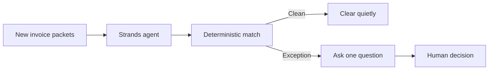

# PayablePilot

PayablePilot is a Strands agent that handles the routine side of accounts
payable and interrupts a person only when money or judgment is at stake.

Try the public demo: https://jonny7171.github.io/payable-pilot/

Try the Nebius + NVIDIA mode:
https://jonny7171.github.io/payable-pilot/?engine=nebius

Try the SerpApi supplier-intelligence mode:
https://jonny7171.github.io/payable-pilot/?engine=serpapi

Watch the 50-second live demo: https://youtu.be/fX2tumerpts

It watches new invoice packets, runs deterministic three-way matching, clears
clean packets, and turns each exception into one concrete approval question.
The included demo finds a two-unit overbill worth exactly $18.40 while clearing
the packet whose purchase order, invoice, and receipt agree.


## Why an agent

This job is a sequence, not a chat. The agent finds pending work, chooses the
right tool for each packet, completes safe work, and stops at a human boundary.
All document facts and money calculations come from deterministic code.

## Architecture




## Run the deterministic workflow

```bash
pnpm install
pnpm test
pnpm demo
pnpm agent:offline
```

`agent:offline` drives the real Strands agent loop with a deterministic test
model. It is a credential-free integration harness, not the production model.

## Run the Strands agent

Configure AWS credentials with Bedrock model access, then:

```bash
cp .env.example .env
pnpm agent
```

The repository also includes an AgentCore-compatible HTTP runtime with `/ping`
and `/invocations` endpoints:

```bash
pnpm agentcore:build
pnpm agentcore:start
```

It also exposes the deterministic decision engine at `POST /v1/decisions` for
API clients. The checked-in [Kong configuration](kong/kong.yml) puts customer
authentication, rate limits, usage metering, and billing in front of that
endpoint. See [the Kong build notes](docs/kong-submission.md) for the validation
path.

The Strands agent uses these custom tools:

- `list_pending_packets`
- `inspect_invoice_packet`
- `clear_clean_packet`
- `queue_human_review`

## Run with NVIDIA Nemotron on Nebius

PayablePilot can use NVIDIA Nemotron 3 Super through the OpenAI-compatible
Nebius Token Factory API while keeping the same Strands tool loop and human
approval boundary. The API key stays on the server. The default output cap is
900 tokens so a test run cannot produce an unbounded response.

```bash
cp .env.example .env
# Add NEBIUS_API_KEY to .env, then load it into your shell.
pnpm agent:nebius
```

The default endpoint and model are:

- `https://api.tokenfactory.us-central1.nebius.com/v1/`
- `nvidia/nemotron-3-super-120b-a12b`

No payment method or Nebius credential is stored in this repository.

## Add live supplier intelligence with SerpApi

When `SERPAPI_API_KEY` is present, PayablePilot adds a guarded
`research_supplier_risk` tool. Exception packets trigger two structured Google
searches through SerpApi: one for supplier identity evidence and one for current
adverse news. The tool returns source links and search IDs. It can report an
identity as unverified, but it never invents a fraud label or risk score.

```bash
SERPAPI_API_KEY=your_key pnpm vendor:intel PP-1042
```

The agent uses this live context before asking a person to decide what happens
to the invoice. Clean packets still clear from deterministic document evidence
without spending a search.

## Safety boundary

The agent may clear a packet only after deterministic checks report no
exception. It may queue an exception for review, but it cannot approve payment
or contact a supplier on a person's behalf.

## Hackathon status

This repository was started on August 27, 2026 during the Agents for Humans
submission period. It is a new implementation for that event. It does not copy
source code from the earlier ClearPacket project.

License: MIT
