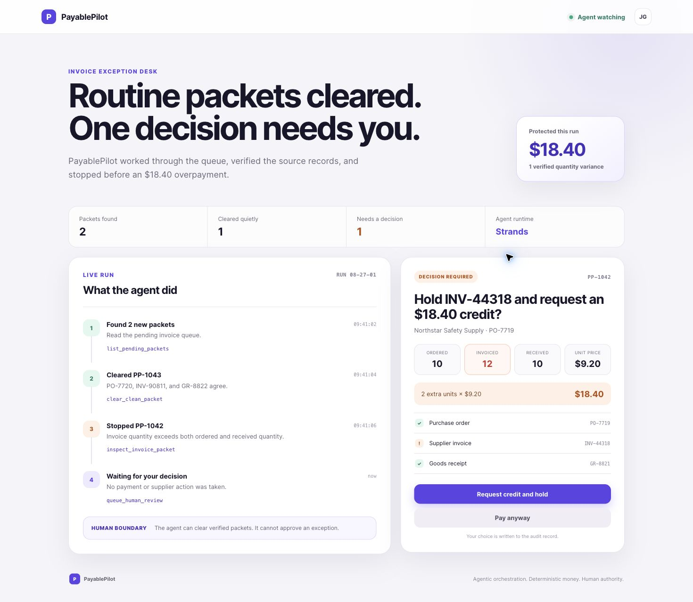
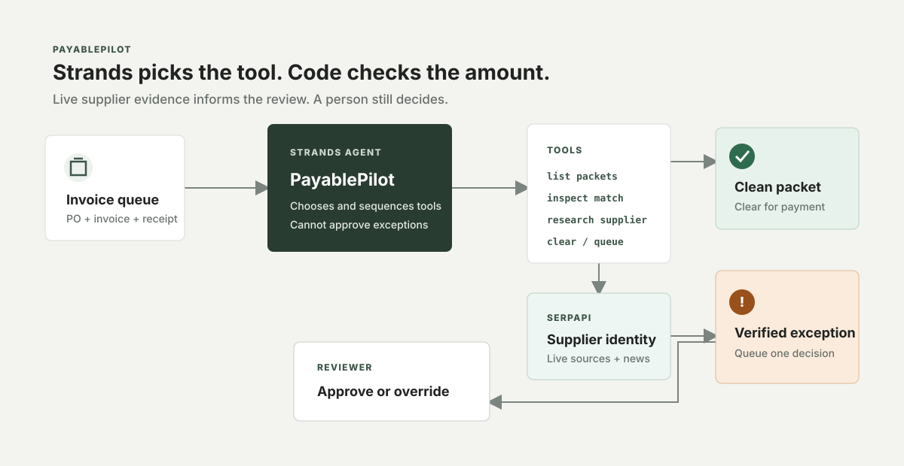
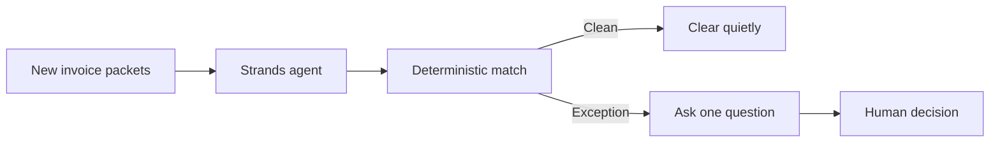

# PayablePilot

PayablePilot is a Strands agent that handles the routine side of accounts
payable and interrupts a person only when money or judgment is at stake.

Try the public demo: https://jonny7171.github.io/payable-pilot/

It watches new invoice packets, runs deterministic three-way matching, clears
clean packets, and turns each exception into one concrete approval question.
The included demo finds a two-unit overbill worth exactly $18.40 while clearing
the packet whose purchase order, invoice, and receipt agree.



## Why an agent

This job is a sequence, not a chat. The agent finds pending work, chooses the
right tool for each packet, completes safe work, and stops at a human boundary.
All document facts and money calculations come from deterministic code.

## Architecture





## Run the deterministic workflow

```bash
pnpm install
pnpm test
pnpm demo
pnpm agent:offline
```

`agent:offline` drives the real Strands agent loop with a deterministic test
model. It is a credential-free integration harness, not the production model.

## Run the Strands agent

Configure AWS credentials with Bedrock model access, then:

```bash
cp .env.example .env
pnpm agent
```

The repository also includes an AgentCore-compatible HTTP runtime with `/ping`
and `/invocations` endpoints:

```bash
pnpm agentcore:build
pnpm agentcore:start
```

The Strands agent uses these custom tools:

- `list_pending_packets`
- `inspect_invoice_packet`
- `clear_clean_packet`
- `queue_human_review`

## Safety boundary

The agent may clear a packet only after deterministic checks report no
exception. It may queue an exception for review, but it cannot approve payment
or contact a supplier on a person's behalf.

## Hackathon status

This repository was started on August 27, 2026 during the Agents for Humans
submission period. It is a new implementation for that event. It does not copy
source code from the earlier ClearPacket project.

License: MIT
