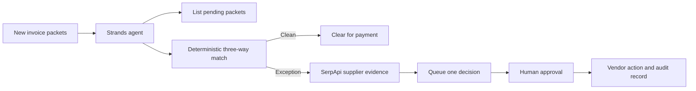

# Architecture

The model chooses which workflow tool to call next. The matching code owns every
fact, verdict, and dollar amount. The agent cannot approve payments, manufacture
evidence, or bypass the human checkpoint.
